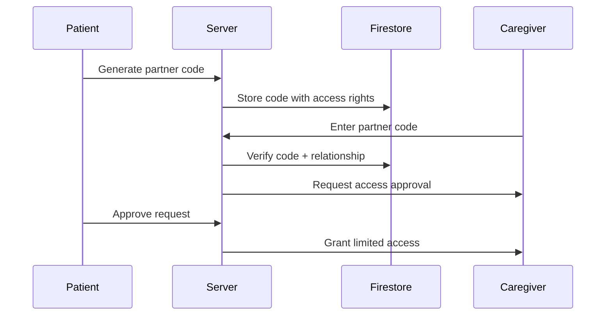

# Maverics

## The Capstone Project

### How to clone
git clone -b test --recurse-submodules https://github.com/Maverics-Seneca/Capstone-Project.git .

### Business Plan

#### 1. Value Proposition
- **Medication adherence platform with smart tracking**
- **Centralized prescription management** for patients/caregivers
- **Data-driven insights** for medication optimization
- **Collaborative care** through partner sharing

#### 2. Target Market
- Chronic illness patients (diabetes, hypertension, etc.)
- Elderly patients with complex medication schedules
- Caregivers managing multiple patients
- Healthcare providers (basic tier for small clinics)

#### 3. Revenue Model
- **Freemium**: Basic features free, premium analytics/partner accounts paid
- **Affiliate Commissions**: 5-15% from pharmacy partner links
- **Enterprise Tier**: White-label solutions for hospitals
- **Data Insights**: Aggregated anonymized data for research (opt-in)

#### 4. Marketing Strategy
- SEO for "medication tracker", "pill reminder" keywords
- Partner with local pharmacies for cross-promotion
- YouTube tutorials demonstrating tracking features
- Healthcare influencer collaborations

---

### Technical Development Plan

#### 1. Tech Stack
- **Frontend**: React.js + Material UI (dynamic banner/notifications)
- **Backend**: Firebase (Firestore + Cloud Functions)
- **APIs**: Node.js/Express for custom endpoints
- **Hosting**: Firebase Hosting + Google Cloud Run
- **Scraping**: Python + Cheerio/BeautifulSoup

#### 2. Core Features Implementation

##### A. Firebase Database Structure
```javascript
// Users Collection
users/{userId}: 
  - medications: array(ref: medications)
  - partnerCode: string
  - prescriptionScanURL: string

// Medications Collection
medications/{medId}:
  - name: string
  - dosage: string
  - remainingCount: number
  - schedule: {times: array, frequency: string}
  - refillAlertThreshold: number

// Partner Links Collection
partnerLinks/{code}:
  - patientId: string
  - accessLevel: 'view' | 'manage'
  - expiration: timestamp
```

##### B. API Endpoints
- `/api/medications` (GET/POST/PUT) - CRUD for medications
- `/api/reminders` (WebSocket) - Real-time dosage alerts
- `/api/partner` (POST) - Generate/verify partner codes
- `/api/scrape` (GET) - Medicine info lookup

##### C. Critical Features Breakdown

###### Dosage Timer Banner
- Firebase scheduled functions trigger client-side notifications
- Real-time updates using Firestore listeners

###### Medicine Data Scraping
- Pre-scrape common drugs from NHS/CDC/DrugBank
- Use Firebase Extensions for scheduled scraping
- Cache results in Firestore

###### Partner Sharing Flow


###### Affiliate System
- Store pharmacy links in Firestore
- Track clicks using Firebase Dynamic Links
- Use affiliate APIs (Amazon Pharmacy, GoodRx)

---

### Security Architecture

#### Auth Layers
- Firebase Authentication with 2FA
- Role-based access control (RBAC)
- Prescription PDFs in Firebase Storage with signed URLs

#### Data Protection
- Firestore security rules for medication data
- HIPAA-compliant encryption at rest (if US-based)
- Partner code expiration (max 24h validity)

#### API Security
- CORS restrictions
- Rate limiting via Firebase Cloud Functions
- Input validation with Zod

---

### Deployment Strategy

#### CI/CD Pipeline
- GitHub Actions for automatic deployments
- Firebase Hosting for frontend
- Docker containers for backend APIs on Cloud Run

#### Monitoring
- Firebase Performance Monitoring
- Cloud Logging for API endpoints
- Uptime checks via Google Cloud Monitoring

#### Scaling Plan
- Firestore automatic scaling
- Cloud Run auto-scaling (max 100 instances)
- CDN caching for medicine info pages

### Microservices Breakdown 
---
| Microservice         | Functionality                                   |
|----------------------|------------------------------------------------|
| auth-service         | User authentication (Firebase Auth + 2FA)       |
| medication-service   | CRUD for medication tracking                    |
| reminder-service     | Real-time notifications & reminders             |
| partner-service      | Partner/caregiver access management             |
| affiliate-service    | Pharmacy links & commissions tracking           |
| scraper-service      | Medicine data lookup & caching                  |
| api-gateway          | Central entry point for all services            |
| frontend             | React-based web UI                              |
| infra                | Infrastructure as Code (Terraform/Kubernetes)   |

### Competitive Advantages
- **Real-Time Collaboration**: Unique partner code system for caregivers
- **Integrated Commerce**: Direct refill links with inventory awareness
- **Visual Analytics**: Medication adherence heatmaps over time
