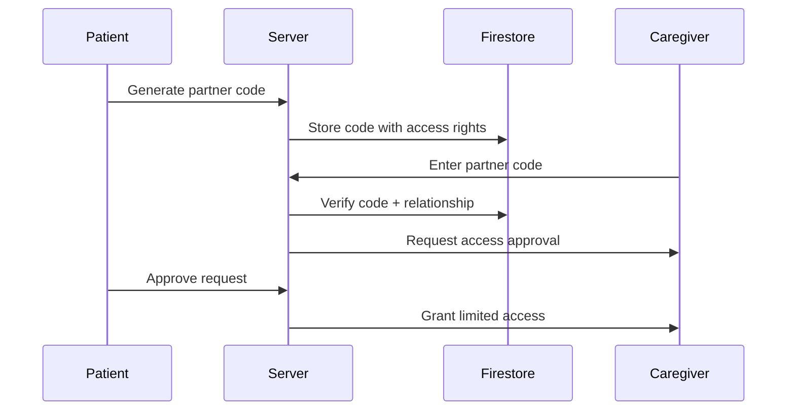

<<<<<<< HEAD
# 🏥 Maverics - Seneca
## The Capstone Project

MediTrack is a **microservices-based medication management platform** that helps users track their medications, set reminders, and allow caregivers to monitor adherence. This project follows a **cloud-native approach** using Firebase, Node.js, Python, Kubernetes, and Terraform.

## 📌 Project Structure
The platform consists of multiple microservices, each handling a specific domain.

```
Maverics-Seneca/
│── auth-service/         # User authentication (Firebase Auth)
│── medication-service/   # CRUD for medication tracking
│── reminder-service/     # Real-time reminders & notifications
│── partner-service/      # Caregiver access management
│── affiliate-service/    # Pharmacy links & commissions
│── scraper-service/      # Medicine data lookup & caching
│── api-gateway/          # Central entry point for all services
│── frontend/             # React-based web UI
│── infra/                # Infrastructure as Code (Terraform/Kubernetes)
```

---

## 🚀 Microservices Overview
Each service runs independently with its own **database, API, and CI/CD pipeline**.

### 1️⃣ **`auth-service` (Authentication)**
- Firebase Authentication (JWT, 2FA, Role-Based Access Control)
- **Tech:** Node.js, Firebase Auth

### 2️⃣ **`medication-service` (Medication Tracking)**
- CRUD operations for medication records
- **Tech:** Node.js, Firebase Firestore

### 3️⃣ **`reminder-service` (Medication Reminders)**
- Sends push notifications & SMS reminders
- **Tech:** Node.js, Firebase Cloud Functions

### 4️⃣ **`partner-service` (Caregiver Access)**
- Allows caregivers to track medication adherence
- **Tech:** Node.js, Firebase Firestore

### 5️⃣ **`affiliate-service` (Pharmacy Links)**
- Tracks pharmacy links & referral commissions
- **Tech:** Node.js, Firebase Firestore

### 6️⃣ **`scraper-service` (Medicine Data Lookup)**
- Scrapes NHS/CDC databases for medicine info
- **Tech:** Python, Cheerio/BeautifulSoup

### 7️⃣ **`api-gateway` (Central API Gateway)**
- Routes requests to appropriate microservices
- **Tech:** Node.js, Express, Firebase Auth Middleware

### 8️⃣ **`frontend` (Web UI)**
- User-friendly React.js interface
- **Tech:** React, Firebase Authentication

### 9️⃣ **`infra` (Infrastructure as Code)**
- Deploys services to Kubernetes & Azure
- **Tech:** Terraform, Kubernetes, Helm

---

## 🏗️ Deployment & Infrastructure
- **Containerized**: All services run in Docker
- **Orchestrated**: Kubernetes for service management
- **CI/CD**: GitHub Actions for automated deployment

---

## 🛠️ Setup & Installation
### **1️⃣ Clone the Repository**
```sh
git clone https://github.com/Maverics-Seneca/Maverics-Seneca.git
cd Maverics-Seneca
```

### **2️⃣ Install Dependencies**
Each microservice has its own dependencies. Install them as needed:
```sh
cd auth-service && npm install
cd ../medication-service && npm install
```

### **3️⃣ Environment Variables**
Each service requires a `.env` file. Example:
```env
FIREBASE_API_KEY=your_api_key
DATABASE_URL=your_database_url
```

### **4️⃣ Run Services**
```sh
cd auth-service && npm start
cd medication-service && npm start
```

### **5️⃣ Run Frontend**
```sh
cd frontend && npm start
```

### **6️⃣ Deploy to Kubernetes**
```sh
kubectl apply -f infra/k8s/
```

---

## 🔥 CI/CD Pipeline
Each service has a GitHub Actions workflow:
```yaml
name: Deploy
on: [push]
jobs:
  build:
    runs-on: ubuntu-latest
    steps:
      - name: Checkout code
        uses: actions/checkout@v2
      - name: Build Docker image
        run: docker build -t my-service .
      - name: Push to registry
        run: docker push my-service
      - name: Deploy to Kubernetes
        run: kubectl apply -f k8s/
```

---

## 📌 Tech Stack
- **Backend**: Node.js, Express, Firebase Firestore
- **Frontend**: HTMML, CSS, Bootstrap
- **Database**: Firebase Firestore
- **Infrastructure**: Kubernetes, Terraform, Docker
- **CI/CD**: GitHub Actions, Azure Kubernetes Service (AKS)

---

## 👥 Contributors
- **Hamza  Siddiqui** - [@hamzasid020](https://github.com/hamzasid020)
- **Arpit Gupta** - [@arpit](https://github.com/)
- **Ranju** - [@Ranju](https://github.com/)
- **Aisha Ansari** - [@aisha](https://github.com/)
- **Ankita Mahajan** - [@ankita](https://github.com/)
---

## 📜 License
MIT License. See `LICENSE` file for details.

---

## 📬 Contact
For questions or contributions, contact **Hamza Siddiqui** at hamzahmedsiddiqui@outlook.com.

### How to clone
git clone -b test --recurse-submodules https://github.com/Maverics-Seneca/Capstone-Project.git .

=======
# Maverics
## The Capstone Project

>>>>>>> d38de1af49450ef896bd069d76e27e2d4258b449
### Business Plan

#### 1. Value Proposition
- **Medication adherence platform with smart tracking**
- **Centralized prescription management** for patients/caregivers
- **Data-driven insights** for medication optimization
- **Collaborative care** through partner sharing

#### 2. Target Market
- Chronic illness patients (diabetes, hypertension, etc.)
- Elderly patients with complex medication schedules
- Caregivers managing multiple patients
- Healthcare providers (basic tier for small clinics)

#### 3. Revenue Model
- **Freemium**: Basic features free, premium analytics/partner accounts paid
- **Affiliate Commissions**: 5-15% from pharmacy partner links
- **Enterprise Tier**: White-label solutions for hospitals
- **Data Insights**: Aggregated anonymized data for research (opt-in)

#### 4. Marketing Strategy
- SEO for "medication tracker", "pill reminder" keywords
- Partner with local pharmacies for cross-promotion
- YouTube tutorials demonstrating tracking features
- Healthcare influencer collaborations

---

### Technical Development Plan

#### 1. Tech Stack
- **Frontend**: React.js + Material UI (dynamic banner/notifications)
- **Backend**: Firebase (Firestore + Cloud Functions)
- **APIs**: Node.js/Express for custom endpoints
- **Hosting**: Firebase Hosting + Google Cloud Run
- **Scraping**: Python + Cheerio/BeautifulSoup

#### 2. Core Features Implementation

##### A. Firebase Database Structure
```javascript
// Users Collection
users/{userId}: 
  - medications: array(ref: medications)
  - partnerCode: string
  - prescriptionScanURL: string

// Medications Collection
medications/{medId}:
  - name: string
  - dosage: string
  - remainingCount: number
  - schedule: {times: array, frequency: string}
  - refillAlertThreshold: number

// Partner Links Collection
partnerLinks/{code}:
  - patientId: string
  - accessLevel: 'view' | 'manage'
  - expiration: timestamp
```

##### B. API Endpoints
- `/api/medications` (GET/POST/PUT) - CRUD for medications
- `/api/reminders` (WebSocket) - Real-time dosage alerts
- `/api/partner` (POST) - Generate/verify partner codes
- `/api/scrape` (GET) - Medicine info lookup

##### C. Critical Features Breakdown

###### Dosage Timer Banner
- Firebase scheduled functions trigger client-side notifications
- Real-time updates using Firestore listeners

###### Medicine Data Scraping
- Pre-scrape common drugs from NHS/CDC/DrugBank
- Use Firebase Extensions for scheduled scraping
- Cache results in Firestore

###### Partner Sharing Flow


###### Affiliate System
- Store pharmacy links in Firestore
- Track clicks using Firebase Dynamic Links
- Use affiliate APIs (Amazon Pharmacy, GoodRx)

---

### Security Architecture

#### Auth Layers
- Firebase Authentication with 2FA
- Role-based access control (RBAC)
- Prescription PDFs in Firebase Storage with signed URLs

#### Data Protection
- Firestore security rules for medication data
- HIPAA-compliant encryption at rest (if US-based)
- Partner code expiration (max 24h validity)

#### API Security
- CORS restrictions
- Rate limiting via Firebase Cloud Functions
- Input validation with Zod

---

### Deployment Strategy


#### CI/CD Pipeline
- GitHub Actions for automatic deployments
- Firebase Hosting for frontend
- Docker containers for backend APIs on Cloud Run

#### Monitoring
- Firebase Performance Monitoring
- Cloud Logging for API endpoints
- Uptime checks via Google Cloud Monitoring

#### Scaling Plan
- Firestore automatic scaling
- Cloud Run auto-scaling (max 100 instances)
- CDN caching for medicine info pages

<<<<<<< HEAD
### Microservices Breakdown 
---
| Microservice         | Functionality                                   |
|----------------------|------------------------------------------------|
| auth-service         | User authentication (Firebase Auth + 2FA)       |
| medication-service   | CRUD for medication tracking                    |
| reminder-service     | Real-time notifications & reminders             |
| partner-service      | Partner/caregiver access management             |
| affiliate-service    | Pharmacy links & commissions tracking           |
| scraper-service      | Medicine data lookup & caching                  |
| api-gateway          | Central entry point for all services            |
| frontend             | React-based web UI                              |
| infra                | Infrastructure as Code (Terraform/Kubernetes)   |
=======
---
>>>>>>> d38de1af49450ef896bd069d76e27e2d4258b449

### Competitive Advantages
- **Real-Time Collaboration**: Unique partner code system for caregivers
- **Integrated Commerce**: Direct refill links with inventory awareness
- **Visual Analytics**: Medication adherence heatmaps over time
